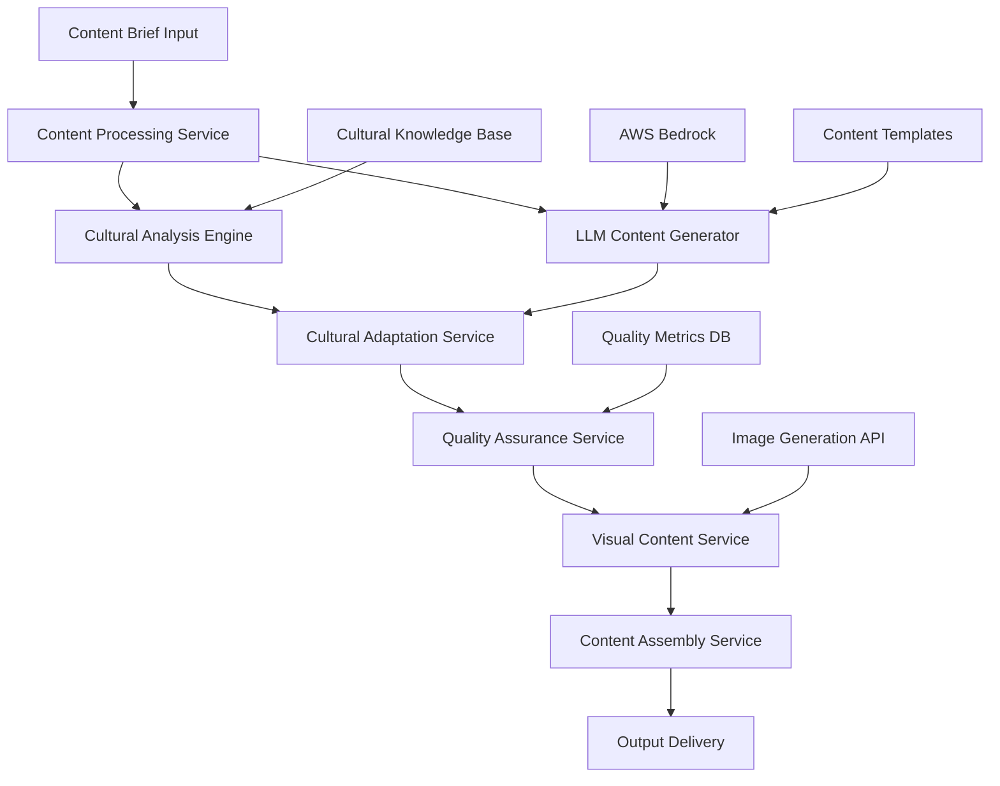

# Multi-Lingual Content Creation Agent - Design Document

## Overview

The Multi-Lingual Content Creation Agent is a cloud-native system that transforms English content briefs into culturally-adapted, multi-lingual content. The system leverages AWS Bedrock LLMs for natural language processing, integrates with image generation services, and employs a sophisticated cultural adaptation engine to ensure content resonates with target audiences.

The architecture follows a microservices pattern with event-driven communication, enabling scalability and maintainability. The system processes content requests through a pipeline that includes cultural analysis, content generation, adaptation, and quality assurance.

## Architecture



The system follows a pipeline architecture where each service has a specific responsibility:

- **Content Processing Service**: Orchestrates the entire workflow and manages request routing
- **Cultural Analysis Engine**: Analyzes target culture and identifies adaptation requirements
- **LLM Content Generator**: Generates base content using AWS Bedrock models
- **Cultural Adaptation Service**: Applies cultural modifications to generated content
- **Quality Assurance Service**: Evaluates content quality and cultural appropriateness
- **Visual Content Service**: Handles image generation and visual recommendations
- **Content Assembly Service**: Combines text and visual elements into final deliverables

## Components and Interfaces

### Content Processing Service
**Responsibilities:**
- Accept and validate content brief requests
- Orchestrate the content generation pipeline
- Manage request state and progress tracking
- Handle error recovery and retry logic

**Key Interfaces:**
```typescript
interface ContentBrief {
  id: string;
  content: string;
  targetLanguage: string;
  targetRegion: string;
  contentType: 'blog' | 'social' | 'email' | 'marketing';
  tone?: 'formal' | 'casual' | 'professional' | 'friendly';
  audience?: string;
  keywords?: string[];
}

interface ContentRequest {
  brief: ContentBrief;
  includeVisuals: boolean;
  urgency: 'low' | 'medium' | 'high';
  qualityLevel: 'standard' | 'premium';
}
```

### Cultural Analysis Engine
**Responsibilities:**
- Maintain cultural knowledge base with regional preferences
- Analyze cultural context for target audience
- Identify potential cultural sensitivities
- Generate cultural adaptation guidelines

**Key Interfaces:**
```typescript
interface CulturalContext {
  region: string;
  language: string;
  communicationStyle: 'direct' | 'indirect' | 'high-context' | 'low-context';
  businessPractices: string[];
  culturalValues: string[];
  sensitivities: string[];
  preferredTone: string;
  localReferences: string[];
}

interface AdaptationGuidelines {
  toneAdjustments: string[];
  contentModifications: string[];
  avoidanceList: string[];
  localizations: string[];
  visualPreferences: string[];
}
```

### LLM Content Generator
**Responsibilities:**
- Interface with AWS Bedrock LLM services
- Generate initial content based on briefs
- Apply format-specific templates
- Handle model selection and prompt engineering

**Key Interfaces:**
```typescript
interface LLMRequest {
  prompt: string;
  model: string;
  maxTokens: number;
  temperature: number;
  culturalContext: CulturalContext;
}

interface GeneratedContent {
  text: string;
  confidence: number;
  model: string;
  generationTime: number;
  tokenCount: number;
}
```

### Cultural Adaptation Service
**Responsibilities:**
- Apply cultural modifications to generated content
- Adapt tone, humor, and references
- Ensure cultural appropriateness
- Maintain adaptation history for learning

**Key Interfaces:**
```typescript
interface AdaptationResult {
  adaptedContent: string;
  modifications: AdaptationLog[];
  confidenceScore: number;
  culturalRiskFlags: string[];
}

interface AdaptationLog {
  type: 'tone' | 'reference' | 'humor' | 'structure';
  original: string;
  adapted: string;
  reason: string;
}
```

### Quality Assurance Service
**Responsibilities:**
- Evaluate content quality and accuracy
- Check cultural appropriateness
- Generate confidence scores
- Flag content for human review when needed

**Key Interfaces:**
```typescript
interface QualityMetrics {
  culturalAppropriatenessScore: number;
  languageQualityScore: number;
  contentAccuracyScore: number;
  overallConfidence: number;
  reviewRequired: boolean;
  flaggedIssues: QualityIssue[];
}

interface QualityIssue {
  type: 'cultural' | 'linguistic' | 'factual' | 'tone';
  severity: 'low' | 'medium' | 'high';
  description: string;
  suggestion: string;
}
```

### Visual Content Service
**Responsibilities:**
- Generate culturally appropriate image suggestions
- Interface with image generation APIs
- Recommend stock images with cultural relevance
- Ensure visual-text coherence

**Key Interfaces:**
```typescript
interface VisualRequest {
  contentContext: string;
  culturalContext: CulturalContext;
  imageType: 'hero' | 'supporting' | 'icon' | 'background';
  style: string;
}

interface VisualRecommendation {
  type: 'generated' | 'stock' | 'custom';
  imageUrl?: string;
  description: string;
  culturalNotes: string[];
  alternativeOptions: string[];
}
```

## Data Models

### Content Pipeline State
```typescript
interface ContentPipelineState {
  requestId: string;
  status: 'pending' | 'processing' | 'review' | 'completed' | 'failed';
  currentStage: string;
  brief: ContentBrief;
  culturalContext?: CulturalContext;
  generatedContent?: GeneratedContent;
  adaptedContent?: AdaptationResult;
  qualityMetrics?: QualityMetrics;
  visualContent?: VisualRecommendation[];
  finalOutput?: FinalContent;
  createdAt: Date;
  updatedAt: Date;
}
```

### Cultural Knowledge Base
```typescript
interface CulturalProfile {
  region: string;
  language: string;
  metadata: {
    population: number;
    primaryLanguages: string[];
    businessHours: string;
    timeZone: string;
  };
  communicationPatterns: {
    directness: number; // 1-10 scale
    formalityLevel: number;
    contextDependency: number;
    emotionalExpression: number;
  };
  businessCulture: {
    hierarchyImportance: number;
    relationshipFocus: number;
    timeOrientation: 'monochronic' | 'polychronic';
    decisionMaking: 'individual' | 'consensus' | 'hierarchical';
  };
  contentPreferences: {
    preferredLength: 'short' | 'medium' | 'long';
    visualImportance: number;
    humorAcceptance: number;
    personalStoryUse: number;
  };
  sensitivities: {
    topics: string[];
    imagery: string[];
    colors: string[];
    symbols: string[];
  };
}
```

### Final Content Output
```typescript
interface FinalContent {
  id: string;
  originalBrief: ContentBrief;
  content: {
    title: string;
    body: string;
    summary: string;
    callToAction?: string;
  };
  metadata: {
    language: string;
    region: string;
    wordCount: number;
    readingTime: number;
    culturalAdaptations: AdaptationLog[];
  };
  visuals: VisualRecommendation[];
  qualityReport: QualityMetrics;
  deliveryFormats: {
    blog?: string;
    social?: string[];
    email?: string;
  };
}
```

## Error Handling

### Error Categories and Responses

**Input Validation Errors:**
- Invalid language/region combinations
- Malformed content briefs
- Unsupported content types
- Response: Return 400 Bad Request with specific validation messages

**External Service Errors:**
- AWS Bedrock API failures
- Image generation service timeouts
- Cultural knowledge base unavailability
- Response: Implement exponential backoff retry with circuit breaker pattern

**Content Quality Errors:**
- Low confidence scores below threshold
- Cultural appropriateness flags
- Language quality issues
- Response: Route to human review queue with detailed error context

**System Errors:**
- Database connection failures
- Memory/processing limits exceeded
- Service communication timeouts
- Response: Graceful degradation with fallback options

### Error Recovery Strategies

1. **Retry Logic**: Exponential backoff for transient failures
2. **Circuit Breaker**: Prevent cascade failures from external services
3. **Fallback Content**: Use simpler generation methods when advanced features fail
4. **Human Escalation**: Route complex cases to human reviewers
5. **Graceful Degradation**: Provide partial results when full pipeline fails

## Testing Strategy

### Unit Testing
- Test individual service components in isolation
- Mock external dependencies (AWS Bedrock, image APIs)
- Validate cultural adaptation logic with known test cases
- Test error handling and edge cases

### Integration Testing
- Test service-to-service communication
- Validate end-to-end pipeline flow
- Test external API integrations with sandbox environments
- Verify data consistency across service boundaries

### Cultural Validation Testing
- Create test cases for major cultural regions
- Validate content appropriateness with native speakers
- Test edge cases for cultural sensitivities
- Benchmark against human-generated cultural adaptations

### Performance Testing
- Load testing for concurrent content generation requests
- Stress testing AWS Bedrock integration limits
- Memory and processing optimization validation
- Response time benchmarking for different content types

### Quality Assurance Testing
- A/B testing of generated content effectiveness
- Cultural expert review of adaptation accuracy
- User acceptance testing with target audiences
- Continuous monitoring of quality metrics in production

### Security Testing
- Input sanitization and validation testing
- API authentication and authorization testing
- Data privacy compliance validation
- Secure handling of cultural and personal data